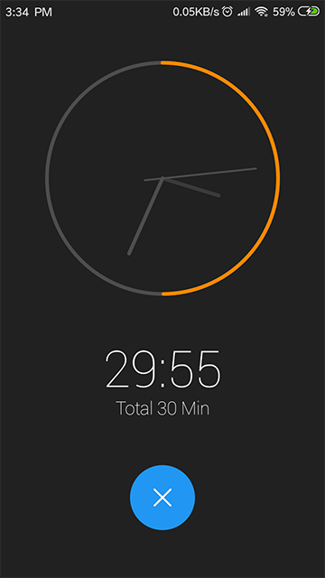
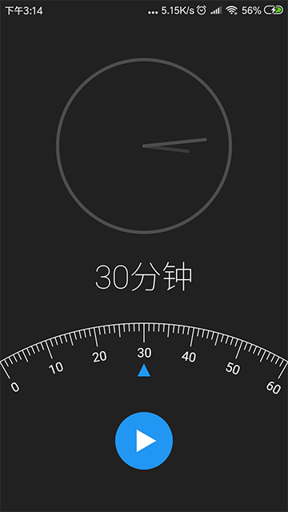

## 简介

午休闹钟，支持 `1~60` 分钟的倒计时。

> **提示**：不要将闹钟转入后台后息屏，这种情况下 CPU 会进入休眠状态，即使申请了 WakeLock 唤醒锁也没用。如果保持闹钟处于前台，那么息屏是没有影响的，因为这种情况下 WakeLock 可以正常工作。

[**Download Apk**](https://image-mk.oss-cn-shenzhen.aliyuncs.com/app/LittleRest_v1.3.2.apk)

## 倒计时

 

 

## License

```
Apache 2.0
```